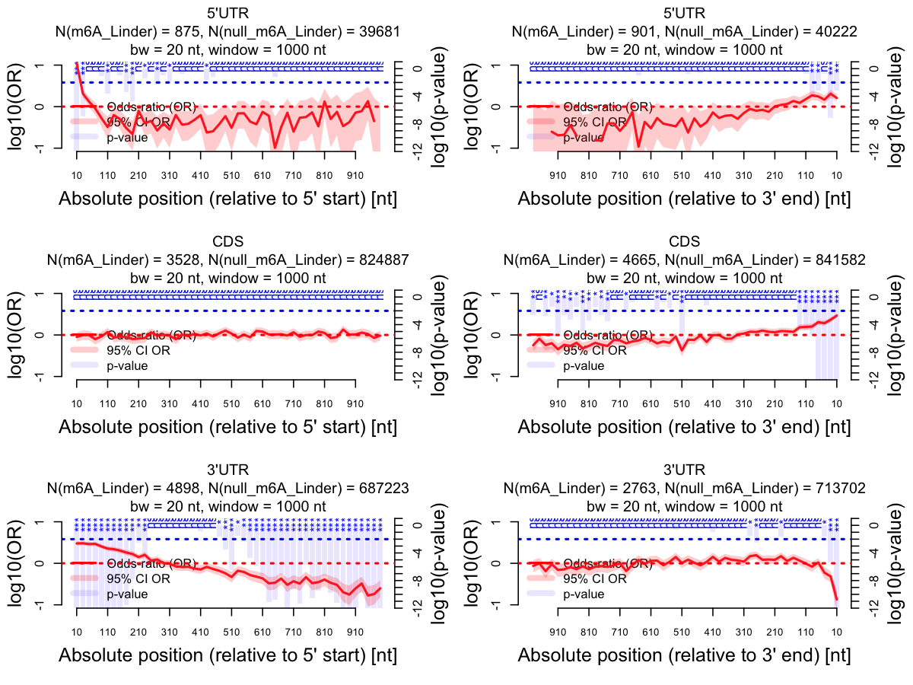

# RNAModR

**RNAModR** provides functions to map lists of genomic loci of RNA modifications
to a reference mRNA transcriptome, and perform exploratory functional analyses
of sites across the transcriptome trough visualisation and statistical analysis
of the distribution of sites across transcriptome regions (5'UTR, CDS, 3'UTR).

**RNAModR** performs enrichment analyses to assess the statistical significance
of the spatial and sequence-specific localisation of RNA modification sites
relative to null sites. Null sites can be generated automatically or may be
supplied manually in the form of a list of genomic loci.

Note that enrichment analyses results may depend critically on the choice and validity
of null sites. For example, in establishing a list of null sites for 5-methylcytidine
modifications, the non-uniformity in the actual distribution of cytosines across
transcript sections makes a simple position permutation approach inappropriate for
generating null sites.

---

**This is production code!** Use it at your own risk. That means that
documentation  may be incomplete and functions may return unexpected errors. It
also means that functionality may change, and backward compatability with code
based on older versions is not guaranteed. A full list of changes in the code
base can be found in the [NEWS](NEWS) file.

I appreciate and encourage any and all testing; for issues, please open an
official [Issue](https://github.com/mevers/RNAModR/issues/new) on the GitHub
project site.

## Table of contents

- [Installing RNAModR](#installing-rnamodr)
    - [The GitHub way](#install-the-github-way)
- [Getting started](#getting-started)
- [Downloadable transcriptome data](#downloadable-transcriptome-data)
- [Documentation](#documentation)
- [FAQ](#faq)
    - [How do I interpret the p-values](#faq-how-do-i-interpret-the-p-values)
- [Contributors](#contributors)
- [Licensing](#licensing)

---

<a name="installing-rnamodr"></a>

## Installing RNAModR

<a name="install-the-github-way"></a>

### The GitHub way (requires the [devtools](https://github.com/hadley/devtools) package)

1. Make sure you the following R/Bioconductor packages are installed

    * AnnotationDbi
    * Biostrings
    * GenomeInfoDb
    * GenomicFeatures
    * GenomicRanges
    * magrittr
    * gplots
    * RSQLite
    * rtracklayer

    The [recommended way to install R/Bioconductor packages](https://www.bioconductor.org/install/) is to use `BiocManager::install`:

    ```{r}
    BiocManager::install(c("AnnotationDbi", "Biostrings", "GenomeInfoDb", "GenomicFeatures", "GenomicRanges", "gplots", "RSQLite", "rtracklayer"))
    ```

    Additionally, RNAModR requires two _organism-specific_ R packages to contruct a custom transcriptome. Currently, RNAModR supports human and mouse data, based on the following reference genome versions

     * Human: hg38, hg19
     * Mouse: mm10, mm9.

    Please install the corresponding organism- and version-matching R/Bioconductor packages. For example, if genomic loci of RNA modification are based on the human GRCh38/hg38 reference genome, RNAModR requires the following R/Bioconductor packages:

     * BSgenome.Hsapiens.UCSC.hg38
     * org.Hs.eg.db

    which you can install in the usual way

    ```{r}
    BiocManager::install(c("BSgenome.Hsapiens.UCSC.hg38", "org.Hs.eg.db"))
    ```

    We also offer the possibility to download pre-constructed transcriptome data, see section [Downloadable transcriptome data](#downloadTx).


2. If all package dependencies are met, install **RNAModR** with devtools

    ```{r}
    if (!require("devtools")) install.packages("devtools")
    devtools::install_github("mevers/RNAModR", build_vignettes = FALSE)
    ```

    You can force a re-install of RNAModR by adding

    ```{r}
    devtools::install_github(..., force = TRUE)
    ```

<a name="getting-started"></a>

## Getting started
The following lines of R code will load the **RNAModR** library, and plot the distribution of m6A sites [[Linder et al., Nature Methods 12, 767 (2015)](http://www.nature.com/nmeth/journal/v12/n8/abs/nmeth.3453.html)] across the 5'UTR, CDS and 3'UTR of the human hg38-based transcriptome.

Note: You can also download pre-constructed transcriptome data, see the [next section](#downloadTx) for details.

```{r}
# Load the library.
library(RNAModR)
library(magrittr)

# Build reference transcriptome.
# This might take a few minutes.
BuildTx("hg38")

# Load and map m6A sites to reference transcriptome.
m6A <- system.file("extdata", "miCLIP_m6A_Linder2015_hg38.bed", package = "RNAModR") %>%
    ReadBED() %>%
    SmartMap("m6A_Linder")

# Keep sites located in the 5'UTR, CDS and 3'UTR
m6A <- m6A %>%
    FilterTxLoc(c("5'UTR", "CDS", "3'UTR"))

# Generate null sites
null <- m6A %>%
    GenerateNull(nt = "A")

# Plot distribution across transcript sections
PlotSpatialEnrichment(m6A, null)
```




<a name="downloadable-transcriptome-data"></a>

## Downloadable transcriptome data

**It is recommended to always custom-build transcriptome data using `BuildTx()`.**

|   Version    | Organism     | Assembly link |
| -------------|--------------|---------------|
| 0.2.2        | Homo sapiens | [hg38](https://drive.google.com/open?id=1fMhubzDyuz52Zh27cuds4QPiKfHUjB8O) |
| 0.2.2        | Homo sapiens | [hg19](https://drive.google.com/open?id=14gHDxM8y9rZLM07l3ExtbKKdtNUNlnsy) |
| 0.2.2        | Homo sapiens | [hg18](https://drive.google.com/open?id=1oE2kFvqE6JO1QEQ7yQpDYCGvvHxgrUER) |
| 0.2.2        | Mus musculus | [mm10](https://drive.google.com/open?id=1NBoctUxhGqpwEMxLEJVMQjuWfIj5kwlm) |
| 0.2.2        | Mus musculus | [mm9](https://drive.google.com/open?id=1n7DVfCzTIp5HmuqytynWwgZTgPyY9O6t) |
| 0.2.2        | Mus musculus | [mm8](https://drive.google.com/open?id=1lqD_8QJYJPfoXDlJYTtHdCBpfTbQ3jSN) |
| <=0.1.1      | Homo sapiens | [hg38](https://drive.google.com/open?id=1nBRsUWEq5FvoZmdYtGJWZhQCi2izajCr)
| <=0.1.1      | Homo sapiens | [hg19](https://drive.google.com/open?id=1OQnsmuieQw7KUXKPy6C5UnZGuavooW06)
| <=0.1.1      | Homo sapiens | [hg18](https://drive.google.com/open?id=18xufP2MQn39gTgkHob8dvOPXiPhKg_wc)
| <=0.1.1      | Mus musculus | [mm10](https://drive.google.com/open?id=17i3yHBjkL50K-o60mMFiP2SzhuW6v9nP)
| <=0.1.1      | Mus musculus | [mm9](https://drive.google.com/open?id=1fO3BSojCb_BIE8DzmEKHw1miJOJZt0Zr)
| <=0.1.1      | Mus musculus | [mm8](https://drive.google.com/open?id=1SqJEX0O6HL1baW8XHWkOMJr37AfAZ4q2)


----

In order to use the transcriptome data you need to copy the RData file into your working directory.
You can check that RNAModR correctly finds the transcriptome data by running e.g.

```{r}
BuildTx("hg38")
```

Provided you have copied the file tx_hg38.RData into the working directory, this should produce the following message

```
Found existing transcriptome data. Nothing to do.
To rebuild run with force = TRUE.
```

<a name="documentation"></a>


## Documentation

The most current RNAModR manual can be downloaded [here](doc/RNAModR-manual.pdf).

<a name="faq"></a>

## FAQ

<a name="faq-how-do-i-interpret-the-p-values"></a>

### How do I interpret the p-values?

> A man who ‘rejects’ a hypothesis provisionally, as a matter of habitual practice, when the significance is at the 1% level or higher, will certainly be mistaken in not more than 1% of such decisions. For when the hypothesis is correct he will be mistaken in just 1% of these cases, and when it is incorrect he will never be mistaken in rejection. [...] However, the calculation is absurdly academic, for in fact no scientific worker has a fixed level of significance at which from year to year, and in all circumstances, he rejects hypotheses; he rather gives his mind to each particular case in the light of his evidence and his ideas.
>
> -- Sir Ronald A. Fisher, from Statistical Methods and Scientific Inference (1956)

Some advice concerning interpreting p-values

1. Be critical and conservative when interpreting statistical significance from the enrichment/depletion analyses.
2. Pay attention to the effect size (e.g. the odds-ratio).
3. p-values are corrected for multiple hypothesis testing assuming individual hypothesis tests (and their associated p-values) to be independent; this may not necessarily be justified. To err on the side of caution and to be conservative, p-values are adjusted using the [Bonferroni correction](https://en.wikipedia.org/wiki/Bonferroni_correction).

<a name="contributors"></a>

## Contributors

Please contact [Maurits Evers](mailto:maurits.evers@anu.edu.au "Email Maurits Evers") in case of questions/suggestions.
In case of bugs/feature requests please open an issue on github.

<a name="licensing"></a>

## Licensing

The **RNAModR** R package is open source licensed under the
GNU Public License, version 3 (GPLv3).
